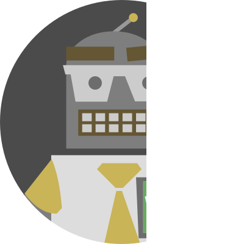

# Wordle Bot

A bot who solves the daily [powerlanguage.co.uk/wordle](https://www.powerlanguage.co.uk/wordle/) and posts the result on twitter.

- 🐦 [twitter account](https://twitter.com/OasisPlatane)
- 📚 [result archive](https://github.com/Platane/wordle-bot/tree/output)

# Implementation

## Automation

The bot launch a browser instance with pupetteer and acts like a regular user.

## Solver

- [baseline solver](src/solver-simple/README.md)
- [advanced solver](src/solver-advanced/README.md)

# Attribution

The word list is extracted from [github.com/powerlanguage/guess-my-word](https://github.com/powerlanguage/guess-my-word/tree/master/wordlist), which was obtained from [scrabbledict](https://sourceforge.net/projects/scrabbledict/). Licensed under [GPL](https://github.com/powerlanguage/guess-my-word/blob/master/wordlist/gpl.txt)
